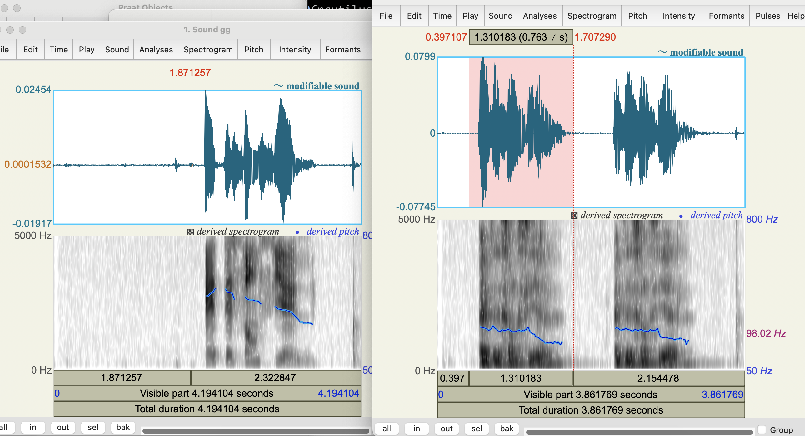

# Day64
> 04/16/2026

> 语言能力不是记忆系统，而是检索速度系统
> 重复的价值不在数量，而在“是否可迁移的结构被自动化”

❌ 100个句子 × 1遍

❌ 1个句子 × 100遍

✅ 10个高价值结构 × 多场景 × 多变体 × 重复强化

# 法语重心
自己不容易感知，用软件分析
 

# 整理task3问题
task3问题可以作为问题训练输入材料，用于备考task2。但是两者之间有一个内化过程。

task3是输入材料，task2是输出组合，中间需要内化的是将task3的材料整理成功能呢+ 句型结构，再匹配场景识别及场景专用词汇，应用语法构建出task2实际需要的问题。

已将问题整理到quizlet，需要：

- [ ] 单词抽取 

- [ ] 诵读顺利

# 背诵科技类话题
科技是最通用的内容，先累积一定科技话题。

# task3 不同于 task1/2
task3是生成系统，task1/2是检索系统。

task1/2本质不是简单，而是自动化：低复杂度+高自动化。

这导致训练掌握task3这种高难度的内容后，并不会直接帮助到task1/2，后者需要每日重复构建自动化，不要思考太多。
