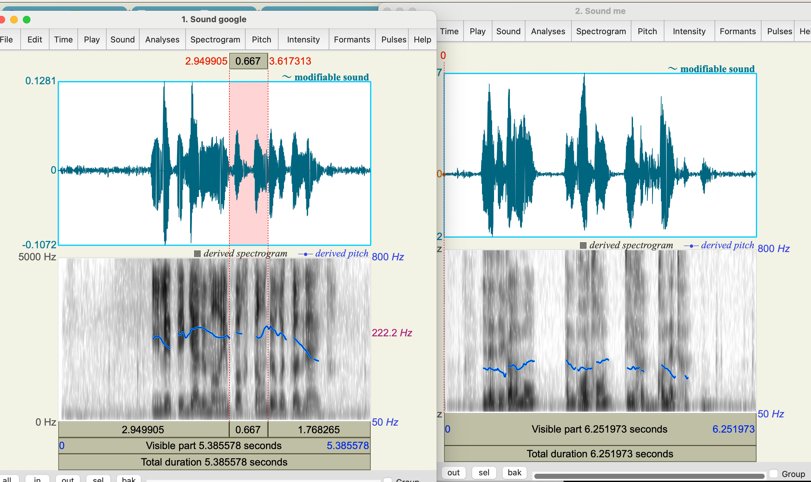
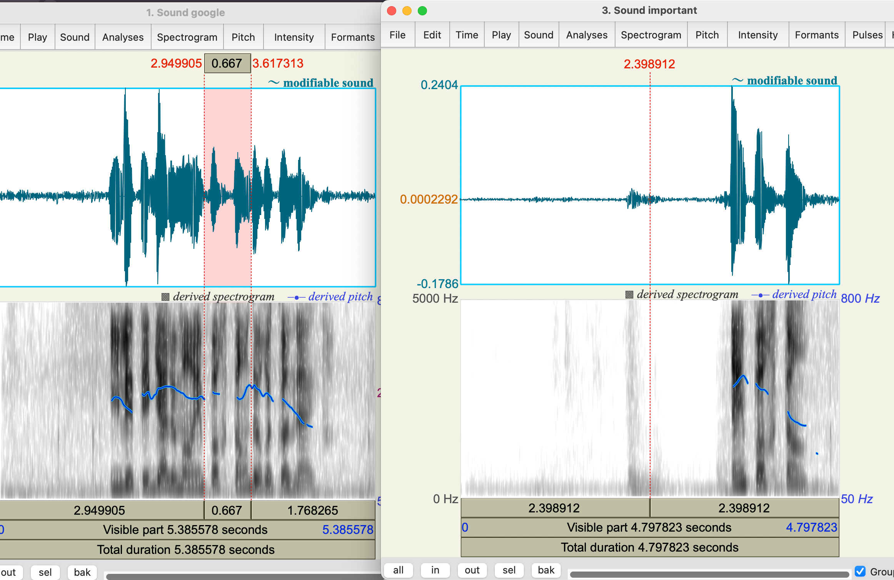

# 法语音高量化分析

# {{fr("Il est également important de reconnaître")}}
## Google 发音  VS. 我自己发音

从中观察到几个现象：

1. me: 语流的连续性不足，google是连在一起的

2. me: 每个音节组尾部音高上升，google每个音节组其实是下降的

## `important`在句子中 VS. 单独发音

观察到：

1. 在句子中是稍微升调，但是单独时候是明显降调
# 原因分析
上述几个现象对比主要是基于**语流**与**重音**这两个概念。

## 语流连续性
法语语流基于音节组，音节组一般由2-4个音节构成，且打破单词本身的边界。

连诵的存在是打破边界的主要实现方式。

整体构成了法语口语的韵律。

## 每个音节组里最后一个音节是重音
这是法语的普遍规律，我的发音是尝试实现这个重音，但是我用**提升音高来实现重音**。这对于**法语重音accent**的理解是错误的。

## 法语的重音：时长、音强、音高
