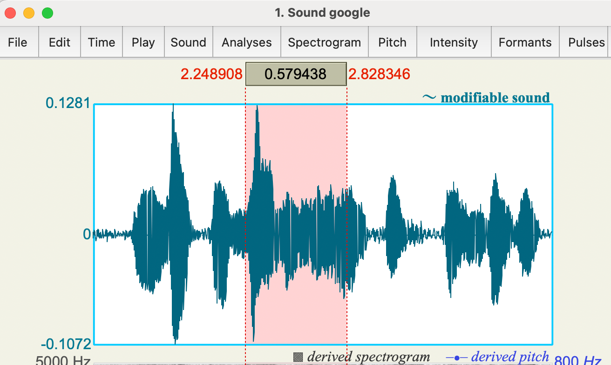
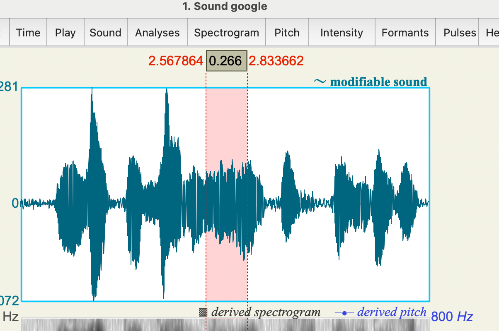

# 法语音高量化分析

# {{fr("Il est également important de reconnaître")}}
## Google 发音  VS. 我自己发音

从中观察到几个现象：

1. me: 语流的连续性不足，google是连在一起的

2. me: 每个音节组尾部音高上升，google每个音节组其实是下降的

## `important`在句子中 VS. 单独发音

观察到：

1. 在句子中是稍微升调，但是单独时候是明显降调
# 原因分析
上述几个现象对比主要是基于**语流**与**重音**这两个概念。

## 语流连续性
法语语流基于音节组，音节组一般由2-4个音节构成，且打破单词本身的边界。

连诵的存在是打破边界的主要实现方式。

整体构成了法语口语的韵律。

## 每个音节组里最后一个音节是重音
这是法语的普遍规律，我的发音是尝试实现这个重音，但是我用**提升音高来实现重音**。这对于**法语重音accent**的理解是错误的。

## 法语的重音：时长、音强、音高
法语的重音通过以上三个因素被感知。
### 音长
法语重音最显著的特征

`galement`这三个音节，一共是0.6的时长，大约一半是`ment`自己的，这就是重音。
### 音强
重音伴随更强的气流。
### 音高
重点是变化，不限于高低。

但是法语整体倾向于**降调**。

### 法语重音 vs 英语重音
我的音高上升是基于对英语重音理解的继承。

英语重音的感知方式：

1. 音高：主要是显著上升

2. 时长：非重读音节被显著压缩

3. 音质：非重读音节原因被压缩变味，形成schwa

大脑去寻找那个最清晰、最饱满的元音，去判定为重音。

4. 音强：最弱的指标

### 总结
法语是syllable-timed language,因此打破这种均衡--把它拉长，就实现了重音。

而英语的stress-timed要保证两个重音之间的时间大致相等，就必须要压缩非重读的音节。

法语不去做这种压缩，每个音节都实在的发出，这就导致学习者觉得**法语语速快**。

# 优化方向

- [ ] 语流连续性：熟练度

- [ ] 重音音节拉长

- [ ] 每个音节清晰，不能类似英语那样模糊
